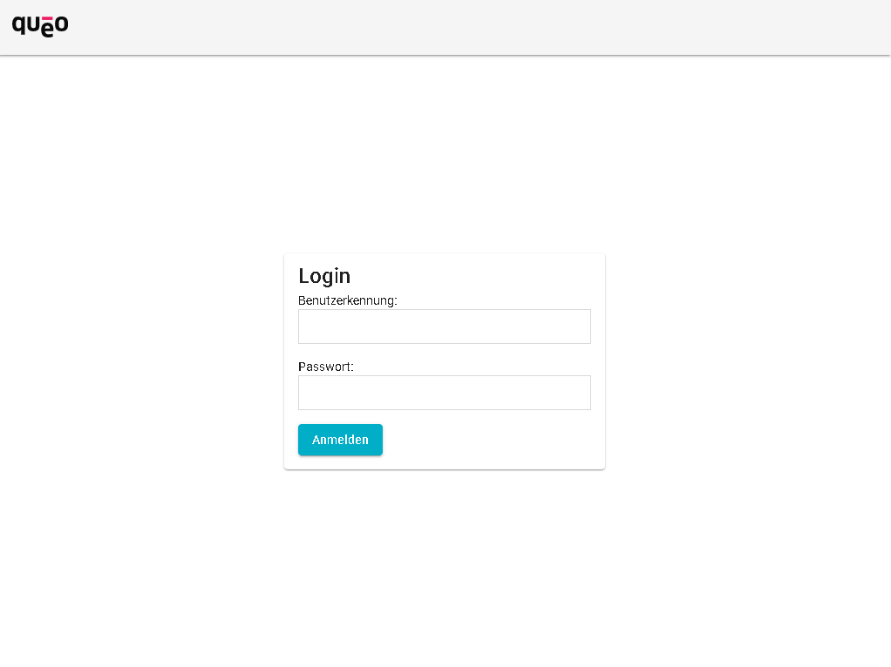
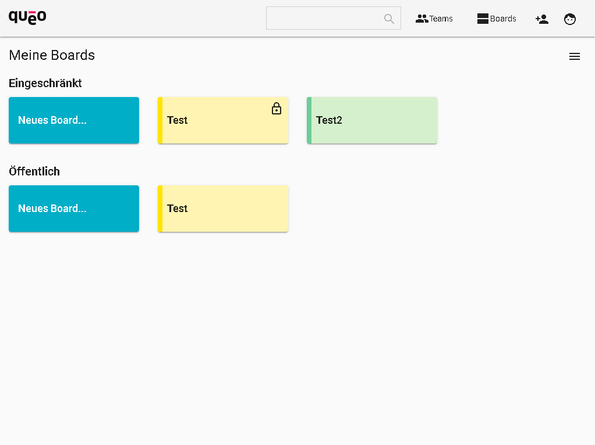
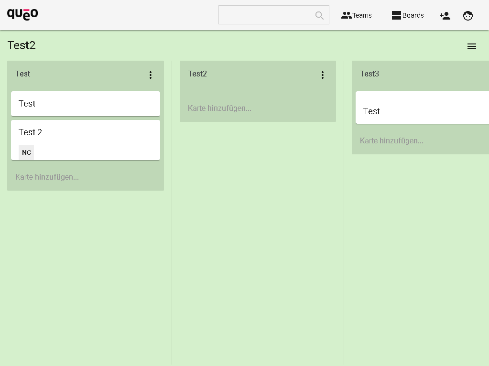

# QUEO BOARDS

## Introduction

with queo boards you can manage easily your things to do.

This repository is just the frontend from the entire project and needs the queo-boards-api to work.
Link to the Backend: https://github.com/queoGmbH/queo-boards-api

## Requirements

* Node.js - v12.11.1

## Installation

* run `npm install`

* navigate in the repository to `"../src/assets/config/config.json"` and set there the `webApiBaseUrl` to your queo-boards-api URL

## Usage

* `npm start`
* navigate in your web browser to `http://localhost:4200`

## Screenshots

